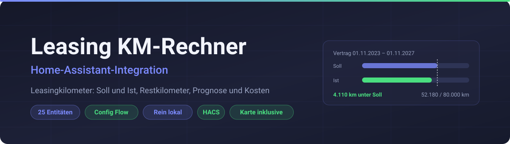
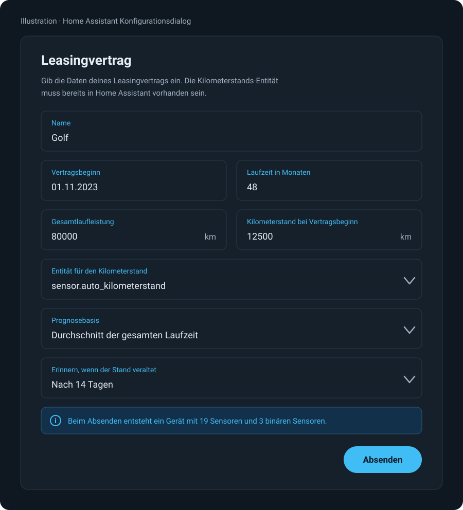
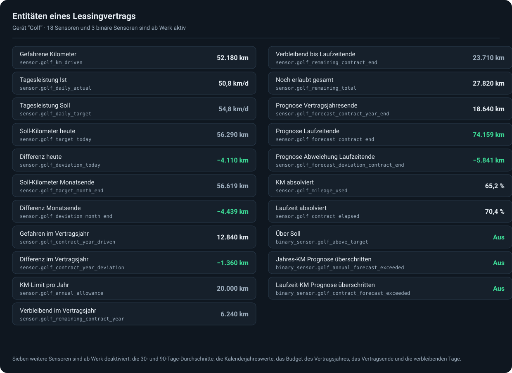
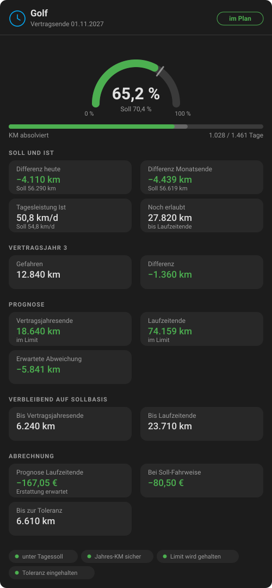
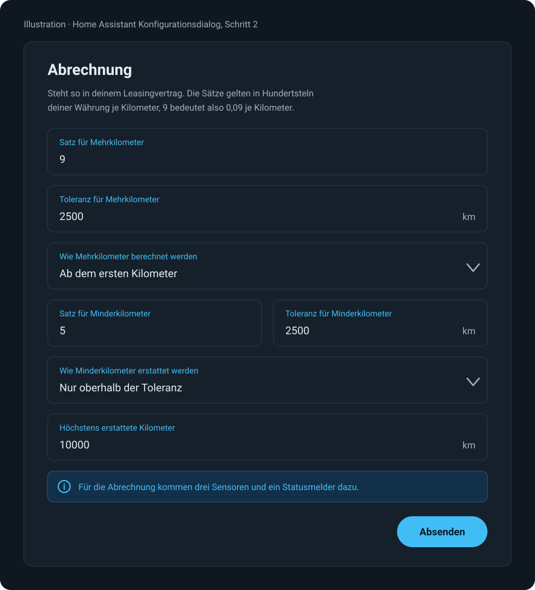

<div align="center">
  

  # Leasing KM-Rechner — Leasingkilometer im Blick behalten mit Home Assistant

  **Zeigt lange vor Vertragsende, ob dein Leasingfahrzeug auf eine Überschreitung zuläuft.**
  Die Integration liest eine beliebige vorhandene Kilometerstands-Entität, vergleicht sie mit dem Vertrag und bringt ihre eigene Lovelace-Karte mit.

  [](https://hacs.xyz/)
  [](https://github.com/sphings79/leasing-km-home-assistant/releases)
  [](https://www.home-assistant.io/)
  [](LICENSE)

  [English](README.md) · **Deutsch**
</div>

## Inhaltsverzeichnis

- [Was die Integration macht](#was-die-integration-macht)
- [Diese Entitäten entstehen](#diese-entitäten-entstehen)
- [Die Karte ist dabei](#die-karte-ist-dabei)
- [Wie gerechnet wird](#wie-gerechnet-wird)
- [Installation](#installation)
- [Konfiguration](#konfiguration)
  - [Kein Sensor im Auto? Von Hand eintragen](#kein-sensor-im-auto-von-hand-eintragen)
  - [Was es kosten wird](#was-es-kosten-wird)
- [Umstieg von Version 1](#umstieg-von-version-1)
- [Automatisierungsbeispiele](#automatisierungsbeispiele)
- [Fehlersuche](#fehlersuche)
- [Häufige Fragen](#häufige-fragen)
- [Haftungsausschluss](#haftungsausschluss)
- [Mitwirken](#mitwirken)
- [Lizenz](#lizenz)

## Was die Integration macht

Ein Leasingvertrag enthält eine bestimmte Laufleistung, und jeder Kilometer darüber kostet am
Ende Geld. Das Problem: Ob man im Plan liegt, erfährt man nur durch eine Rechnung, die niemand
regelmäßig macht.

Diese Integration macht sie laufend. Du gibst an, wann der Vertrag begann, wie lange er läuft,
wie viele Kilometer er enthält und was der Tacho am ersten Tag zeigte. Daraus ergibt sich, was du
bis heute hättest fahren dürfen, was du tatsächlich gefahren bist und wo dieser Trend am letzten
Vertragstag landet.

Alles läuft lokal. Keine Netzwerkanfragen, keine API-Schlüssel, kein Cloud-Konto: Die Integration
hat überhaupt keine `requirements` und liest nur eine Entität, die es bei dir ohnehin gibt.

<div align="center">
  
</div>

## Diese Entitäten entstehen

Ein Gerät je Vertrag, benannt wie du es benennst. Die Entitäts-IDs sind sprachunabhängig und
lauten in jeder Installation gleich; übersetzt werden nur die angezeigten Namen.

<div align="center">
  
</div>

| Entität | Bedeutung | Beispiel |
| --- | --- | --- |
| `sensor.<name>_km_driven` | Gefahren seit Vertragsbeginn | `52180 km` |
| `sensor.<name>_daily_actual` | Bisheriger Schnitt pro Tag | `50,8 km/d` |
| `sensor.<name>_daily_target` | Was der Vertrag pro Tag erlaubt | `54,8 km/d` |
| `sensor.<name>_target_today` | Wo du heute stehen solltest | `56290 km` |
| `sensor.<name>_deviation_today` | Ist minus Soll, negativ ist gut | `-4110 km` |
| `sensor.<name>_target_month_end` | Sollstand am Monatsende | `56619 km` |
| `sensor.<name>_deviation_month_end` | Differenz zum Monatsende | `-4439 km` |
| `sensor.<name>_contract_year_driven` | Gefahren im laufenden Vertragsjahr | `12840 km` |
| `sensor.<name>_contract_year_deviation` | Differenz innerhalb dieses Jahres | `-1360 km` |
| `sensor.<name>_annual_allowance` | Laut Vertrag erlaubte Kilometer pro Jahr | `20000 km` |
| `sensor.<name>_remaining_contract_year` | Rest im Vertragsjahr auf Sollbasis | `6240 km` |
| `sensor.<name>_remaining_contract_end` | Rest bis Laufzeitende auf Sollbasis | `23710 km` |
| `sensor.<name>_remaining_total` | Restkilometer im Vertrag, nach Überschreitung negativ | `27820 km` |
| `sensor.<name>_forecast_contract_year_end` | Hochrechnung zum Ende des Vertragsjahres | `18640 km` |
| `sensor.<name>_forecast_contract_end` | Hochrechnung auf den letzten Vertragstag | `74159 km` |
| `sensor.<name>_forecast_deviation_contract_end` | Erwartete Abweichung zur Laufleistung | `-5841 km` |
| `sensor.<name>_mileage_used` | Anteil der genutzten Laufleistung, kann über 100 % gehen | `65,2 %` |
| `sensor.<name>_contract_elapsed` | Anteil der abgelaufenen Laufzeit | `70,4 %` |
| `binary_sensor.<name>_above_target` | An, wenn du heute über der Solllinie liegst | `Aus` |
| `binary_sensor.<name>_annual_forecast_exceeded` | An, wenn dieses Vertragsjahr über Budget läuft | `Aus` |
| `binary_sensor.<name>_contract_forecast_exceeded` | An, wenn der ganze Vertrag über Budget läuft | `Aus` |

Acht weitere Sensoren sind ab Werk deaktiviert und lassen sich einzeln einschalten: die 30- und
90-Tage-Durchschnitte, die Kalenderjahreswerte, das Budget des Vertragsjahres, das Vertragsende,
die verbleibenden Tage und die Tage seit der letzten Aktualisierung des Kilometerstands.

`sensor.<name>_contract_elapsed` trägt zusätzlich die Vertragsdaten als Attribute:
`contract_end`, `elapsed_days`, `total_days`, `days_remaining`, `contract_year`,
`contract_year_start` und `contract_year_end`.

## Die Karte ist dabei

Es gibt nichts zweites zu installieren. Die Integration bringt die Lovelace-Karte mit, liefert sie
aus und trägt die Ressource selbst ein — **Leasing KM Card** steht direkt nach der Einrichtung in
der Kartenauswahl.

<div align="center">
  
</div>

| Option | Standard | Wirkung |
| --- | --- | --- |
| `device_id` | erster gefundener Vertrag | Welcher Vertrag angezeigt wird |
| `title` | der Gerätename | Überschreibt die Überschrift |
| `clamp_percent` | `false` | Kappt den Prozentwert bei 100 %, statt die echte Überschreitung zu zeigen |
| `show_contract_year` | `true` | Zeigt den Vertragsjahresblock |
| `show_forecast` | `true` | Zeigt den Prognoseblock |
| `show_costs` | `true` | Zeigt die Abrechnung, sofern konfiguriert |

Die Karte folgt deinem Theme: Sie verwendet ausschließlich die CSS-Variablen von Home Assistant und
funktioniert dadurch in hellen wie dunklen Themes ohne eigene Einstellung. Sie ist in dieselben elf
Sprachen übersetzt wie die Integration und lädt nur den Katalog deiner Sprache.

Läuft dein Dashboard im **YAML-Modus**, verwaltet Home Assistant die Ressourcenliste nicht. Dann
trägst du sie einmalig selbst ein:

```yaml
lovelace:
  resources:
    - url: /leasing_km/leasing-km-card.js
      type: module
```

## Wie gerechnet wird

Gerechnet wird durchgängig mit `Tachostand − Kilometerstand bei Vertragsbeginn`, nie mit dem rohen
Tachostand. Dieser Unterschied entscheidet bei jedem Gebrauchtwagen und jeder Vertragsübernahme.

| Wert | Formel |
| --- | --- |
| Tagesleistung Soll | `Gesamtlaufleistung ÷ Vertragstage` |
| Tagesleistung Ist | `gefahren ÷ vergangene Tage` |
| Soll heute | `Tagesleistung Soll × vergangene Tage` |
| Differenz | `gefahren − Soll heute` |
| Prognose | `gefahren + (gewählte Tagesrate × Resttage)` |
| Verbleibend auf Sollbasis | `Tagesleistung Soll × Tage bis zum jeweiligen Stichtag` |

Das Modell unterstellt einen **konstanten Tagesdurchschnitt**, statt Saisonalität abbilden zu
wollen. Das ist dieselbe lineare Grundlage, mit der auch die Leasinggesellschaft rechnet, und
macht die Prognose nachvollziehbar. Es heißt aber auch, dass sie in den ersten Wochen stark
schwankt, weil eine einzelne lange Fahrt den Schnitt deutlich bewegt, und sich mit der Zeit
beruhigt.

**Vertragsjahre laufen ab dem Vertragsbeginn**, nicht ab Januar. Ein Vertrag ab März läuft sein
erstes Jahr bis zum folgenden März; ein angebrochenes letztes Jahr wird am Vertragsende gekappt,
sodass die einzelnen Jahre zusammen exakt die Vertragslaufzeit ergeben. Für die im laufenden
Vertragsjahr gefahrenen Kilometer wird der Tachostand vom ersten Tag dieses Jahres gebraucht, der
aus dem Recorder kommt. Fehlt er, bleiben genau diese beiden Sensoren unbekannt, alles andere
rechnet weiter.

## Installation

### Variante A: HACS

1. HACS, Drei-Punkte-Menü, **Benutzerdefinierte Repositories**
2. `https://github.com/sphings79/leasing-km-home-assistant` hinzufügen, Kategorie **Integration**
3. **Leasing KM Calculator** installieren und Home Assistant neu starten
4. **Einstellungen, Geräte & Dienste, Integration hinzufügen**, nach `Leasing` suchen

### Variante B: manuell

1. `custom_components/leasing_km` nach `config/custom_components` kopieren
2. Home Assistant neu starten
3. Integration wie oben hinzufügen

## Konfiguration

Alles wird im Dialog eingestellt und lässt sich später über **Neu konfigurieren** am
Integrationseintrag ändern.

| Option | Bedeutung |
| --- | --- |
| **Name** | Wird als Gerätename verwendet, zum Beispiel der Name des Autos |
| **Vertragsbeginn** | Erster Tag des Vertrags |
| **Laufzeit in Monaten** | Zum Beispiel 24, 36 oder 48 |
| **Gesamtlaufleistung** | Die im Vertrag enthaltene Laufleistung |
| **Kilometerstand bei Vertragsbeginn** | `0` beim Neuwagen, der tatsächliche Stand beim Gebrauchtwagen oder einer Vertragsübernahme |
| **Entität für den Kilometerstand** | Ein `sensor`, eine `number` oder ein `input_number` mit dem aktuellen Stand |
| **Prognosebasis** | Durchschnitt der gesamten Laufzeit, letzte 30 Tage oder letzte 90 Tage |
| **Erinnern, wenn der Stand veraltet** | Aus, oder nach 7, 14 oder 30 Tagen ohne Änderung |
| **Kosten berechnen** | Öffnet einen zweiten Schritt für die Abrechnungssätze |

### Was es kosten wird

Schaltest du **Kosten berechnen** ein, fragt ein zweiter Schritt die Abrechnungssätze deines
Vertrags ab.

<div align="center">
  
</div>

Zweimal lesen lohnt sich bei einem Punkt — **wie die Toleranz wirkt**. Verträge machen es
unterschiedlich, und der Unterschied ist teuer:

| | 2.501 km über der Laufleistung, Toleranz 2.500 km, 0,09 je km |
| --- | --- |
| **Ab dem ersten Kilometer** (Freigrenze) | alle 2.501 km werden berechnet: **225,09** |
| **Nur oberhalb der Toleranz** (Freibetrag) | 1 km wird berechnet: **0,09** |

Beides kommt vor, deshalb ist beides wählbar — getrennt für Mehr- und Minderkilometer. Die
Voreinstellung folgt dem üblichen deutschen Vertrag: Mehrkilometer ab dem ersten, Erstattung erst
oberhalb der Toleranz und gedeckelt durch die Erstattungsgrenze.

Die Sätze trägst du in Hundertsteln deiner Währung je Kilometer ein, so wie Verträge sie angeben:
`9` bedeutet 0,09 je Kilometer. Die Währung kommt aus deinen Home-Assistant-Einstellungen.

Dazu kommen drei Sensoren und ein Statusmelder:

| Entität | Bedeutung |
| --- | --- |
| `sensor.<name>_cost_forecast_contract_end` | Was die Abrechnung kostet, wenn du weiterfährst wie bisher |
| `sensor.<name>_cost_at_target_pace` | Was sie kostet, wenn du ab heute genau auf Soll fährst |
| `sensor.<name>_km_to_excess_tolerance` | Kilometer, bis die Toleranz für Mehrkilometer aufgebraucht ist |
| `binary_sensor.<name>_excess_tolerance_exceeded` | An, wenn die Prognose diese Toleranz überschreitet |

Ein negativer Betrag ist eine Erstattung. Die Zahlen sind so gut wie deine Vertragsdaten und das
lineare Modell dahinter — eine Rechnung sind sie nicht.

### Kein Sensor im Auto? Von Hand eintragen

Hat dein Auto keine Integration, legst du einen `input_number` an und trägst den Stand ein, wenn du
tankst oder daran denkst. Damit genau dieses Daran-Denken nicht die Schwachstelle bleibt, kann die
Integration die Entität im Auge behalten: Ändert sich der Wert 7, 14 oder 30 Tage lang nicht,
erscheint eine Reparaturmeldung, die nach einem frischen Stand fragt — **mit einem Feld, in das du
ihn direkt einträgst**. Beim Absenden schreibt die Integration den Wert in deinen `input_number`
und die Meldung verschwindet.

Die Erinnerung gibt es bewusst nur für einen selbst gepflegten `input_number`. Ein Sensor aus einer
Fahrzeug-Integration schweigt, solange das Auto steht — dieselbe Erinnerung wäre dort nur ein
Fehlalarm.

Sie übersteht Neustarts: Home Assistant stellt einen `input_number` beim Start wieder her, was die
Frist sonst bei jedem Neustart zurücksetzen würde. Deshalb merkt sich die Integration den Stand und
den Zeitpunkt der letzten Änderung selbst.

Die Kilometerfelder gelten in der Einheit deiner Kilometerstands-Entität. Die Entitäten tragen die
Geräteklasse `distance`, Home Assistant rechnet also um, falls dein Einheitensystem abweicht.

**Mehrere Verträge** legst du an, indem du die Integration erneut hinzufügst — einmal je Fahrzeug.

## Umstieg von Version 1

Version 2 migriert einen bestehenden Vertrag automatisch, zwei Dinge solltest du aber wissen.

**Trag den Kilometerstand bei Vertragsbeginn nach.** Die Migration setzt ihn auf `0`, damit sich
zunächst keine Zahl ändert. Stand bei Vertragsbeginn schon etwas auf dem Tacho, öffne **Neu
konfigurieren** und trag den Wert ein. Bis dahin rechnet die Integration mit dem rohen Tachostand,
so wie Version 1 es tat.

**Die Entitäts-IDs haben sich geändert.** Version 1 benannte die Entitäten deutsch, aus
`sensor.…_km_absolviert` wurde `sensor.…_mileage_used`. Home Assistant benennt sie beim Upgrade um
und legt eine Reparaturmeldung an, die jede Umbenennung auflistet — damit kannst du Dashboards,
Automatisierungen und Skripte nachziehen. Selbst umbenannte Entitäts-IDs bleiben unangetastet.

Wer bisher das separate Repository `leasing_km_card` genutzt hat, entfernt es aus HACS und löscht
den zugehörigen Ressourceneintrag: Die Karte kommt jetzt mit der Integration.

## Automatisierungsbeispiele

Einmalig warnen, sobald die Prognose über das Limit zeigt:

```yaml
automation:
  - alias: Leasingkilometer gefährdet
    triggers:
      - trigger: state
        entity_id: binary_sensor.golf_contract_forecast_exceeded
        to: "on"
        for: "24:00:00"
    actions:
      - action: notify.persistent_notification
        data:
          title: Leasingkilometer
          message: >
            Beim aktuellen Schnitt endet der Vertrag bei
            {{ states('sensor.golf_forecast_contract_end') }} km,
            {{ states('sensor.golf_forecast_deviation_contract_end') }} km über der Laufleistung.
```

Monatliche Zusammenfassung am Monatsersten:

```yaml
automation:
  - alias: Leasingkilometer Monatsbericht
    triggers:
      - trigger: time
        at: "09:00:00"
    conditions:
      - condition: template
        value_template: "{{ now().day == 1 }}"
    actions:
      - action: notify.mobile_app_handy
        data:
          message: >
            {{ states('sensor.golf_deviation_today') }} km gegenüber Soll,
            {{ states('sensor.golf_remaining_total') }} km Restlaufleistung.
```

## Fehlersuche

**Die Entitäten sind direkt nach der Einrichtung nicht verfügbar.** Die Kilometerstands-Entität hat
noch nie einen brauchbaren Wert geliefert. Sobald sie das tut, lädt der Vertrag von selbst.

**Die Werte bewegen sich nicht mehr.** Das ist so gewollt, solange die Kilometerstands-Entität
nicht verfügbar ist: Der letzte bekannte Stand wird gehalten und die Sollwerte laufen weiter. Ein
Auto, das eine Woche offline ist, reißt damit nicht die ganze Rechnung mit.

**Ein Wert ist nach einem Fahrzeugwechsel viel zu hoch.** Ein Stand unterhalb des letzten bekannten
wird ignoriert und mit beiden Werten im Log vermerkt. Hat sich die Quelle wirklich geändert,
konfiguriere den Vertrag neu.

**`Gefahren im Vertragsjahr` ist unbekannt.** Der Recorder hat keinen Tachowert vom ersten Tag des
Vertragsjahres. In den ersten Wochen einer Installation und bei Verträgen, die älter sind als die
Recorder-Historie, ist das normal.

## Häufige Fragen

**Brauche ich dafür eine Fahrzeug-Integration?**
Nein. Es genügt eine beliebige Entität mit einer Zahl, auch ein `input_number`, den du einmal pro
Woche von Hand pflegst. Für diesen Fall erinnert dich die Integration auf Wunsch, wenn der Wert
veraltet — siehe [Kein Sensor im Auto? Von Hand eintragen](#kein-sensor-im-auto-von-hand-eintragen).

**Mein Tacho liefert Meilen. Geht das?**
Ja. Trag den Vertrag ebenfalls in Meilen ein, dann rechnet die Integration durchgängig in Meilen.
Steht dein Home Assistant auf metrisch, werden die Werte für die Anzeige umgerechnet.

**Was passiert, wenn die Entität kurz nicht verfügbar ist?**
Nichts kaputt. Siehe Fehlersuche.

**Braucht die Prognose den Recorder?**
Nur für die 30- und 90-Tage-Durchschnitte und für die im laufenden Vertragsjahr gefahrenen
Kilometer. Die voreingestellte Prognosebasis ist der Durchschnitt der gesamten Laufzeit und kommt
ganz ohne Historie aus.

**Kann ich einen Vertrag erfassen, der vor Jahren begann?**
Ja. Trag den echten Vertragsbeginn und den Tachostand von diesem Tag ein.

**Meine Laufleistung ist pro Jahr angegeben, nicht insgesamt.**
Trag die Gesamtsumme ein: Bei drei Jahren mit 20.000 km pro Jahr also `60000` und `36` Monate.
`sensor.<name>_annual_allowance` meldet dir den Jahreswert zurück.

**Geht das auch für mehrere Autos?**
Ja, die Integration einfach je Fahrzeug einmal hinzufügen. Jeder Vertrag wird ein eigenes Gerät,
und in der Karte wählst du aus, welcher angezeigt wird.

## Haftungsausschluss

Dies ist ein Community-Projekt, weder verbunden mit noch unterstützt von einer Leasinggesellschaft
oder einem Hersteller. Die Zahlen sind eine Schätzung auf Basis eines linearen Modells und der
Entität, auf die du zeigst. Sie sind keine rechtsverbindliche Aussage zu deinem Vertrag — es zählt
allein der Kilometerstand, den deine Leasinggesellschaft bei der Rückgabe abliest.

## Mitwirken

Issues und Pull Requests sind willkommen. `pytest`, `ruff check`, `ruff format` und für die Karte
`npm run build` in `frontend/` laufen in der CI; das eingecheckte Karten-Bundle muss zu seinen
Quellen passen.

## Lizenz

[MIT](LICENSE)

---

<sub>Home Assistant Leasingkilometer · Leasing KM-Rechner · Kilometerstand überwachen ·
Laufleistung Prognose · Leasingvertrag Kilometer · HACS Integration · Lovelace-Karte</sub>
