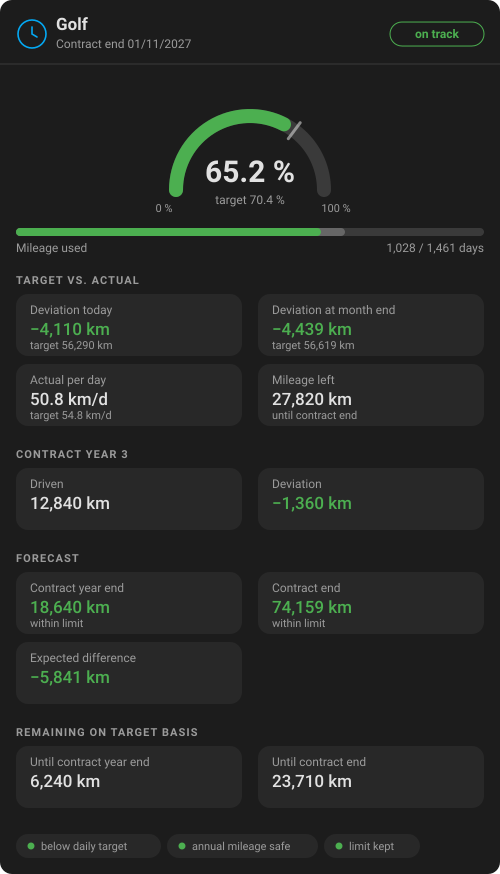

<div align="center">
  

  # Leasing KM Calculator — Leasing Mileage Tracker for Home Assistant

  **Tells you whether your leased car is heading for its mileage limit, long before the contract ends.**
  It reads any odometer entity you already have, compares it against the contract, and ships its own Lovelace card.

  [](https://hacs.xyz/)
  [](https://github.com/sphings79/leasing-km-home-assistant/releases)
  [](https://www.home-assistant.io/)
  [](LICENSE)

  **English** · [Deutsch](README.de.md)
</div>

## Table of contents

- [What this integration does](#what-this-integration-does)
- [Entities you get](#entities-you-get)
- [The card is included](#the-card-is-included)
- [How the numbers are calculated](#how-the-numbers-are-calculated)
- [Installation](#installation)
- [Configuration](#configuration)
- [Upgrading from version 1](#upgrading-from-version-1)
- [Automation examples](#automation-examples)
- [Troubleshooting](#troubleshooting)
- [FAQ](#faq)
- [Disclaimer](#disclaimer)
- [Contributing](#contributing)
- [License](#license)

## What this integration does

A leasing contract gives you a mileage allowance, and every kilometre over it costs money at the
end. The problem is that you only find out whether you are on track by doing arithmetic nobody
does regularly.

This integration does it continuously. You tell it when the contract started, how long it runs,
how many kilometres it includes and what the odometer read on day one. From there it works out
what you should have driven by today, what you actually drove, and where that trend ends up on
the last day of the contract.

Everything happens locally. There are no network requests, no API keys and no cloud account:
the integration has no `requirements` at all and only reads an entity that already exists in
your installation.

<div align="center">
  
</div>

## Entities you get

One device per contract, named the way you named it. The entity ids are language independent, so
they read the same in every installation; only the displayed names are translated.

<div align="center">
  
</div>

| Entity | Meaning | Example |
| --- | --- | --- |
| `sensor.<name>_km_driven` | Driven since the contract started | `52180 km` |
| `sensor.<name>_daily_actual` | Average per day so far | `50.8 km/d` |
| `sensor.<name>_daily_target` | What the contract allows per day | `54.8 km/d` |
| `sensor.<name>_target_today` | Where you should be today | `56290 km` |
| `sensor.<name>_deviation_today` | Actual minus target, negative is good | `-4110 km` |
| `sensor.<name>_target_month_end` | Where you should be at the end of the month | `56619 km` |
| `sensor.<name>_deviation_month_end` | Deviation at the end of the month | `-4439 km` |
| `sensor.<name>_contract_year_driven` | Driven in the running contract year | `12840 km` |
| `sensor.<name>_contract_year_deviation` | Deviation within that year | `-1360 km` |
| `sensor.<name>_annual_allowance` | Mileage the contract allows per year | `20000 km` |
| `sensor.<name>_remaining_contract_year` | Left this contract year, on target basis | `6240 km` |
| `sensor.<name>_remaining_contract_end` | Left until the contract ends, on target basis | `23710 km` |
| `sensor.<name>_remaining_total` | Mileage left in the contract, negative once exceeded | `27820 km` |
| `sensor.<name>_forecast_contract_year_end` | Projected total at the end of the contract year | `18640 km` |
| `sensor.<name>_forecast_contract_end` | Projected total on the last day | `74159 km` |
| `sensor.<name>_forecast_deviation_contract_end` | Projected difference to the allowance | `-5841 km` |
| `sensor.<name>_mileage_used` | Share of the allowance used, can exceed 100 % | `65.2 %` |
| `sensor.<name>_contract_elapsed` | Share of the contract elapsed | `70.4 %` |
| `binary_sensor.<name>_above_target` | On when you are ahead of the target line today | `off` |
| `binary_sensor.<name>_annual_forecast_exceeded` | On when this contract year is heading over budget | `off` |
| `binary_sensor.<name>_contract_forecast_exceeded` | On when the whole contract is heading over budget | `off` |

Seven more sensors ship disabled and can be switched on per entity: the 30 and 90 day averages,
the calendar year figures, the contract year allowance, the contract end date and the days
remaining.

`sensor.<name>_contract_elapsed` also carries the contract metadata as attributes:
`contract_end`, `elapsed_days`, `total_days`, `days_remaining`, `contract_year`,
`contract_year_start` and `contract_year_end`.

## The card is included

There is no second thing to install. The integration ships the Lovelace card, serves it and
registers the resource for you, so **Leasing KM Card** appears in the card picker right after
setup.

<div align="center">
  
</div>

| Option | Default | What it does |
| --- | --- | --- |
| `device_id` | first contract found | Which contract the card shows |
| `title` | the device name | Overrides the heading |
| `clamp_percent` | `false` | Caps the percentage at 100 % instead of showing the real overrun |
| `show_contract_year` | `true` | Shows the contract year section |
| `show_forecast` | `true` | Shows the forecast section |

The card follows your theme: it only uses Home Assistant's own CSS variables, so it works in
light and dark themes without a setting of its own. It is translated into the same eleven
languages as the integration and loads only the catalog for your language.

If your dashboard is in **YAML mode**, Home Assistant does not manage the resource list, so add
it yourself once:

```yaml
lovelace:
  resources:
    - url: /leasing_km/leasing-km-card.js
      type: module
```

## How the numbers are calculated

Everything is measured against `odometer − odometer at contract start`, never against the raw
odometer reading. That distinction matters for every used car and every contract taken over.

| Value | Formula |
| --- | --- |
| Target per day | `total mileage ÷ contract days` |
| Actual per day | `driven ÷ days elapsed` |
| Target today | `target per day × days elapsed` |
| Deviation | `driven − target today` |
| Forecast | `driven + (selected daily rate × days remaining)` |
| Remaining on target basis | `target per day × days to the date in question` |

The model assumes a **constant daily average** rather than trying to be clever about seasonality.
That is the same linear basis a leasing company uses, and it makes the forecast easy to argue
with. It does mean the forecast swings in the first weeks of a contract, when a single long trip
moves the average a lot, and settles down as the contract progresses.

**Contract years roll from the contract start date**, not from January. A contract starting in
March runs its first year until the following March; a final partial year is cut off at the
contract end, so the individual years always add up to the full contract. The mileage driven in
the running contract year needs the odometer reading from the day that year started, which comes
from the recorder. Without it those two sensors stay unknown and everything else keeps working.

## Installation

### Option A: HACS

1. HACS, three dot menu, **Custom repositories**
2. Add `https://github.com/sphings79/leasing-km-home-assistant`, category **Integration**
3. Install **Leasing KM Calculator** and restart Home Assistant
4. **Settings, Devices & services, Add integration**, search for `Leasing`

### Option B: manual

1. Copy `custom_components/leasing_km` into your `config/custom_components` directory
2. Restart Home Assistant
3. Add the integration as above

## Configuration

Everything is configured in the dialog, and everything can be changed later through
**Reconfigure** on the integration entry.

| Option | Meaning |
| --- | --- |
| **Name** | Used as the device name, for example the name of the car |
| **Contract start date** | First day of the contract |
| **Contract duration in months** | For example 24, 36 or 48 |
| **Total mileage allowance** | The mileage included in the contract |
| **Odometer reading at contract start** | `0` for a new car, the real reading for a used car or a contract taken over |
| **Odometer entity** | A `sensor`, `number` or `input_number` holding the current odometer reading |
| **Forecast basis** | Whole contract average, last 30 days or last 90 days |

The mileage fields are in whatever unit your odometer entity reports. The entities carry the
`distance` device class, so Home Assistant converts them for you if your unit system differs.

Setting up **several contracts** is just adding the integration again, once per vehicle.

## Upgrading from version 1

Version 2 migrates an existing contract automatically, but there are two things to know.

**Set the odometer reading at contract start.** The migration fills it with `0`, which keeps every
number exactly as it was. If your car had mileage on the clock when the contract started, open
**Reconfigure** and enter it. Until you do, the integration measures against the raw odometer, as
version 1 did.

**Entity ids changed.** Version 1 named entities in German, so `sensor.…_km_absolviert` is now
`sensor.…_mileage_used`. Home Assistant renames them during the upgrade and raises a repair issue
listing every rename, so you can update dashboards, automations and scripts. Entity ids you had
renamed yourself are left alone.

If you used the separate `leasing_km_card` repository, remove it from HACS and delete its resource
entry: the card now comes with the integration.

## Automation examples

Warn once when the forecast starts pointing over the limit:

```yaml
automation:
  - alias: Leasing mileage at risk
    triggers:
      - trigger: state
        entity_id: binary_sensor.golf_contract_forecast_exceeded
        to: "on"
        for: "24:00:00"
    actions:
      - action: notify.persistent_notification
        data:
          title: Leasing mileage
          message: >
            At the current rate the contract ends at
            {{ states('sensor.golf_forecast_contract_end') }} km,
            {{ states('sensor.golf_forecast_deviation_contract_end') }} km over the allowance.
```

A monthly summary on the first of the month:

```yaml
automation:
  - alias: Leasing mileage monthly summary
    triggers:
      - trigger: time
        at: "09:00:00"
    conditions:
      - condition: template
        value_template: "{{ now().day == 1 }}"
    actions:
      - action: notify.mobile_app_phone
        data:
          message: >
            {{ states('sensor.golf_deviation_today') }} km against target,
            {{ states('sensor.golf_remaining_total') }} km left of the allowance.
```

## Troubleshooting

**The entities are unavailable right after setup.** The odometer entity has never reported a
usable number. Once it does, the contract loads by itself.

**The values stopped moving.** That is intended while the odometer is unavailable: the last known
reading is kept and the targets keep moving on, so a car that is offline for a week does not take
the whole calculation down with it.

**A value looks far too high after a vehicle change.** A reading that is lower than the last known
one is ignored, and a warning naming both values is written to the log. Reconfigure the contract
if the odometer source really changed.

**`Driven this contract year` is unknown.** The recorder has no odometer value from the day the
contract year started. This is normal in the first weeks of an installation and for contracts
older than the recorder history.

## FAQ

**Do I need a vehicle integration for this?**
No. Any entity holding a number will do, including an `input_number` you type into once a week.

**My odometer reports miles. Does that work?**
Yes. Enter the contract in miles as well, and the integration keeps everything in miles. If your
Home Assistant is set to metric, the values are converted for display.

**What happens if the odometer entity is briefly unavailable?**
Nothing breaks. See Troubleshooting above.

**Does the forecast need the recorder?**
Only for the 30 and 90 day averages and for the mileage driven in the running contract year.
The default forecast basis is the whole contract average, which needs no history at all.

**Can I track a contract that started years ago?**
Yes. Enter the real start date and the odometer reading from that day.

**My allowance is stated per year, not in total.**
Enter the total: for a three year contract at 20,000 km a year, that is `60000` and `36` months.
`sensor.<name>_annual_allowance` reports the annual figure back to you.

**Can I use this for several cars?**
Yes, add the integration once per vehicle. Each contract becomes its own device, and the card
lets you pick which one it shows.

## Disclaimer

This is a community project, not affiliated with or endorsed by any leasing company or
manufacturer. The figures are an estimate based on a linear model and the odometer entity you
point it at. They are not a legal statement about your contract, and only the mileage your
leasing company reads at handover counts.

## Contributing

Issues and pull requests are welcome. `pytest`, `ruff check`, `ruff format` and, for the card,
`npm run build` in `frontend/` all run in CI; the committed card bundle has to match its sources.

## License

[MIT](LICENSE)

---

<sub>Home Assistant leasing mileage · leasing kilometre tracker · car mileage allowance monitor ·
odometer forecast · leasing contract mileage · HACS custom integration · Lovelace card</sub>
