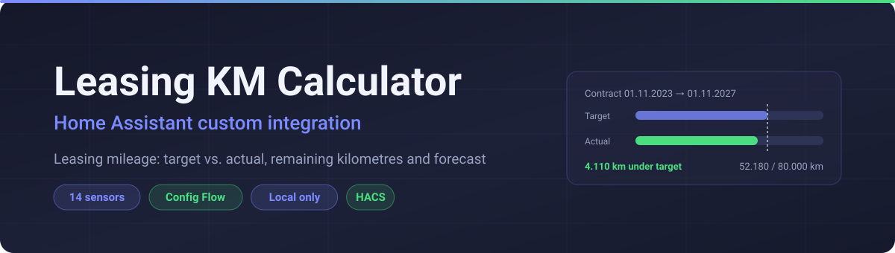
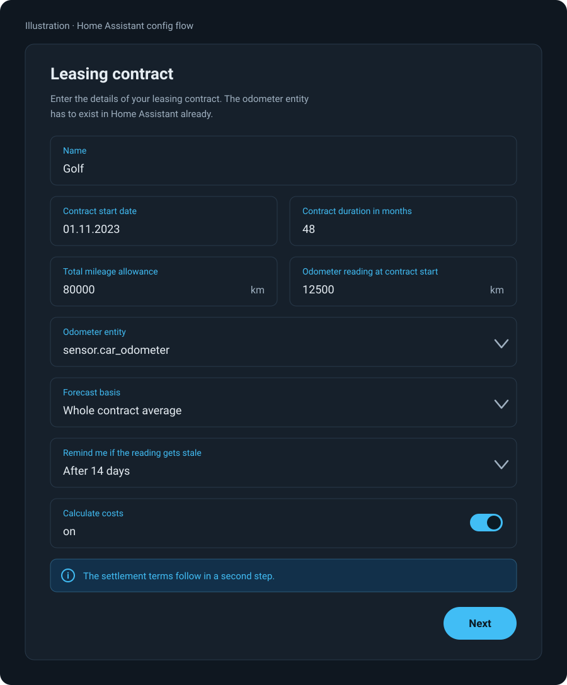
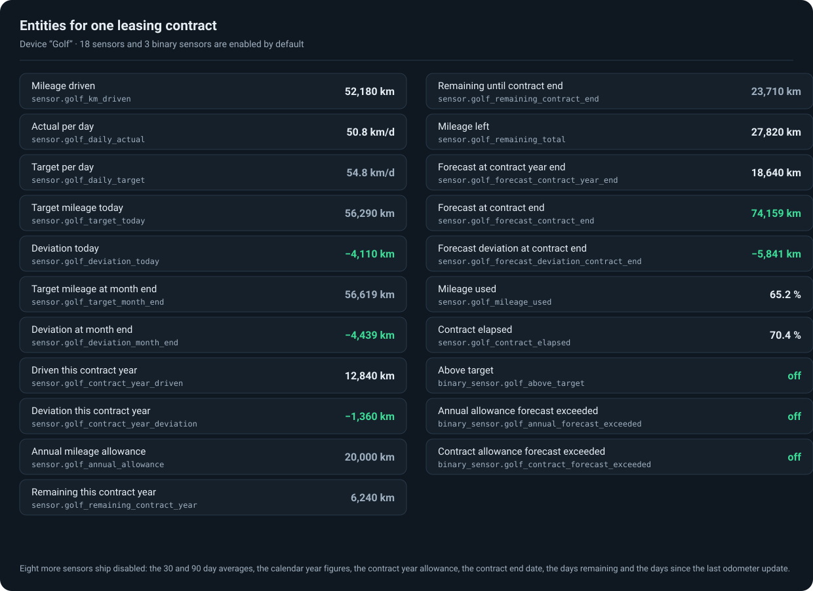

<div align="center">



# Leasing KM Calculator for Home Assistant

**Know months in advance whether your leased car will run over its contracted mileage — and by how much.**

[](https://hacs.xyz)
[](LICENSE)
[](https://www.home-assistant.io)
[](#privacy)

**English** · [Deutsch](README.de.md)

</div>

---

## What this integration does

A leasing contract gives you a fixed number of kilometres over a fixed period — for example
80,000 km over 48 months. Every kilometre beyond that is billed at the end, typically per
kilometre, and by then it is too late to do anything about it.

This custom integration for [Home Assistant](https://www.home-assistant.io) takes your contract
data and one odometer entity, and continuously answers three questions:

- **Where should I be today?** The contract's target mileage for the current date, and how far
  above or below it you actually are.
- **Where will I end up?** A forecast of your odometer reading at the end of the year and at the
  end of the contract, extrapolated from the pace you have driven so far.
- **How much is left?** Remaining kilometres until the end of the year and until the contract
  ends — both on a target basis and as an absolute figure against the contract limit.

It creates **14 sensors** and **3 binary sensors** on one device. The binary sensors are what you
build automations on: they switch on as soon as the current pace projects an overrun.

Everything is computed locally from data already in Home Assistant. There is no API, no account
and no cloud service involved.

---

## Screens

> The images below are illustrations of the integration's dialogs, not photographs of a running
> instance.

<div align="center">

</div>

Four fields, all in the UI — there is no YAML configuration. The odometer entity is picked from a
dropdown of the sensors that already exist in your instance.

<div align="center">

</div>

All entities are grouped under a single device named after the contract, so a second leased car
stays cleanly separated from the first.

---

## Requirements

| Requirement | Details |
|---|---|
| Home Assistant | 2026.4 or newer |
| HACS | Optional, for convenient installation and updates |
| An odometer entity | A `sensor` or `input_number` holding the current odometer reading **in km** |

The odometer entity is the only thing this integration cannot produce for you. Common sources:

- **Vehicle integrations** — BMW Connected Drive, Tesla, Volkswagen We Connect, Skoda Connect,
  Mercedes me, Renault, Kia/Hyundai Bluelink and others expose a mileage sensor.
- **OBD-II dongles** — via the `obd` integration or an MQTT bridge.
- **A manual `input_number` helper** — perfectly workable if you type the odometer reading in
  every few weeks. The forecast gets more accurate the more often you update it, but it does not
  need daily values.

---

## Installation

### Option A — HACS (recommended)

1. Open HACS → **Integrations** → three-dot menu → **Custom repositories**
2. Add the URL of this repository, category **Integration** → **Add**
3. Search for **“Leasing KM-Rechner”** and install it
4. Restart Home Assistant

### Option B — manual

1. Download the folder `custom_components/leasing_km` from this repository
2. Copy it to `config/custom_components/leasing_km` on your Home Assistant host
3. Restart Home Assistant

---

## Setup

1. **Settings → Devices & Services → + Add integration → “Leasing KM-Rechner”**
2. Fill in the dialog:

| Field | Meaning | Example |
|---|---|---|
| **Contract start date** | First day of the leasing contract | `01.11.2023` |
| **Contract duration** | Contract length in months | `48` |
| **Total allowed kilometres** | Kilometres included in the contract | `80000` |
| **Current odometer entity** | Sensor or `input_number` with the odometer reading | `sensor.car_odometer` |

3. **Submit** — every entity is created immediately.

All four values can be changed later through the **gear icon** on the integration; the entities
keep their IDs and history.

> **A note on language.** Both the setup dialog and the **entity names** follow your Home Assistant
> language, in English and German. Entity **IDs** are deliberately fixed and do not change with the
> language — they stay the German-derived ids listed below, so dashboards, automations and the
> [companion card](https://github.com/sphings79/leasing_km_card) keep working when you switch
> languages.

---

## Entities

The names below are the English ones. In a German instance the same entities are called
*Tagesleistung Ist*, *Differenz heute* and so on — only the display name changes, never the
entity ID.

All entities live on one device named after the contract. The `…` in the entity IDs below is the
slug of that device name — with a device called *Leasing VW Golf*, `sensor.…_differenz_heute`
becomes `sensor.leasing_vw_golf_differenz_heute`.

### Sensors

| Entity | What it tells you | Unit |
|---|---|---|
| `sensor.…_tagesleistung_ist` | Actual average per day since the contract started | km |
| `sensor.…_tagesleistung_soll` | Average per day the contract allows | km |
| `sensor.…_soll_km_heute` | Odometer reading you *should* be at today | km |
| `sensor.…_differenz_heute` | Deviation from today's target (+ = over, − = under) | km |
| `sensor.…_soll_km_monatsende` | Target odometer reading at the end of this month | km |
| `sensor.…_differenz_monatsende` | Deviation from the end-of-month target | km |
| `sensor.…_verbleibend_bis_jahresende` | Target kilometres still available until 31 December | km |
| `sensor.…_verbleibend_bis_laufzeitende` | Target kilometres still available until the contract ends | km |
| `sensor.…_noch_erlaubt_gesamt` | Absolute kilometres left before hitting the contract limit | km |
| `sensor.…_km_limit_pro_jahr` | Annual mileage allowance implied by the contract | km |
| `sensor.…_prognose_jahresende` | Projected odometer reading on 31 December | km |
| `sensor.…_prognose_laufzeitende` | Projected odometer reading when the contract ends | km |
| `sensor.…_km_absolviert` | Share of the total allowance used | % |
| `sensor.…_laufzeit_absolviert` | Share of the contract period elapsed | % |

Comparing the last two is the quickest health check there is: as long as **KM absolviert** stays
below **Laufzeit absolviert**, you are driving within the contract.

### Binary sensors

| Entity | `on` means |
|---|---|
| `binary_sensor.…_ueber_soll` | You are currently above the day's target — you have driven too much so far |
| `binary_sensor.…_jahres_km_prognose_ueberschritten` | At the current pace, the annual allowance will be exceeded |
| `binary_sensor.…_laufzeit_km_prognose_ueberschritten` | At the current pace, the total contract limit will be exceeded |

The first one reacts to today's snapshot; the other two are forecasts and are the ones worth
sending a notification about.

---

## Update behaviour

- Refreshes automatically every **30 minutes**
- Refreshes **immediately** whenever the odometer entity reports a new value
- Can be refreshed manually via **Settings → Devices & Services → Reload**

Because the maths is pure arithmetic on values already in Home Assistant, a refresh costs
nothing measurable — there is no network request involved.

---

## Examples

### Automation: notify when the contract limit is at risk

```yaml
automation:
  - alias: "Leasing mileage warning"
    trigger:
      - platform: state
        entity_id: binary_sensor.leasing_laufzeit_km_prognose_ueberschritten
        to: "on"
    action:
      - service: notify.notify
        data:
          title: "⚠️ Leasing mileage warning"
          message: >
            Projected at contract end:
            {{ states('sensor.leasing_prognose_laufzeitende') }} km —
            currently {{ states('sensor.leasing_differenz_heute') }} km off target.
```

### Dashboard: entities card

```yaml
type: entities
title: Leasing mileage
entities:
  - sensor.leasing_differenz_heute
  - sensor.leasing_prognose_laufzeitende
  - sensor.leasing_noch_erlaubt_gesamt
  - sensor.leasing_km_absolviert
  - binary_sensor.leasing_ueber_soll
  - binary_sensor.leasing_laufzeit_km_prognose_ueberschritten
```

For a purpose-built dashboard card with a gauge, progress bar and forecast tiles, see
**[Leasing KM Card](https://github.com/sphings79/leasing_km_card)**.

### Template sensor: traffic-light status

```yaml
template:
  - sensor:
      - name: "Leasing status"
        state: >
          
            red
          
            amber
          
            green
          
        icon: >
          
            mdi:alert-circle
          
            mdi:alert
          
            mdi:check-circle
          
```

---

## Several vehicles

The integration supports multiple instances. Add another one through **“+ Add integration”** for
each leased car — every instance gets its own device, its own entities and its own contract data.

---

## How the numbers are calculated

| Value | Formula |
|---|---|
| Target km/day | `total_km ÷ total contract days` |
| Actual km/day | `current_km ÷ days elapsed` |
| Target km today | `target km/day × days elapsed` |
| Deviation | `current_km − target km today` |
| Forecast | `current_km + (actual km/day × days remaining)` |
| Remaining (target basis) | `target km/day × days remaining` |

The model deliberately assumes a **constant daily average** rather than trying to be clever about
seasonality. In practice that is the right call for a leasing contract: it is the same linear
basis the leasing company uses, and it makes the forecast easy to reason about. It also means the
forecast is volatile in the first weeks of a contract, when a single long trip moves the daily
average a lot, and settles down as the contract progresses.

---

## Privacy

Everything happens locally inside Home Assistant. The integration makes **no network requests at
all** — it has no `requirements`, contacts no API, and sends nothing anywhere. Your contract data
and mileage never leave your instance.

---

## FAQ

**Do I need a vehicle integration for this to work?**
No. Any entity holding a number in kilometres will do, including an `input_number` you update by
hand.

**My odometer entity reports miles. Can I use it?**
Not directly — the integration expects kilometres. Create a template sensor that converts the
value (`{{ states('sensor.odometer') | float * 1.609344 }}`) and point the integration at that.

**What happens if the odometer entity is briefly unavailable?**
The last known values are kept and the sensors stop updating until a valid number arrives again.
No spikes are written to history.

**Can I track a contract that already started years ago?**
Yes. Enter the real contract start date; the integration works out days elapsed from it. The
actual km/day figure is derived from your current odometer reading, so it is correct from the
first refresh.

**Does it handle a mileage allowance stated per year rather than in total?**
Enter the total for the contract — for a 3-year contract at 20,000 km/year, enter `60000` and
`36` months. `sensor.…_km_limit_pro_jahr` then reports the annual figure back to you.

---

## Related

- **[Leasing KM Card](https://github.com/sphings79/leasing_km_card)** — the matching Lovelace card
  for this integration: gauge, progress bar, forecast tiles and status pills.
- **[More projects and tools](https://sphings-dev.de/)**

---

## Changelog

### 1.1.0
- **Entity names are now translated** into English and German, following the Home Assistant language
- Entity IDs are pinned and no longer depend on the UI language, so existing dashboards and
  automations are unaffected

### 1.0.0
- First release
- 14 sensors and 3 binary sensors
- Config flow with date, number and entity pickers
- Options flow and reconfigure support
- Immediate update when the odometer entity changes state
- German and English translation of the setup dialog

---

---

## ☕ Support

These tools are built and maintained in my free time, and they stay free, open and cloud-free.
If one of them saved you an afternoon, you can [buy me a coffee](https://buymeacoffee.com/sphings).

[](https://buymeacoffee.com/sphings)

## License

MIT — see [LICENSE](LICENSE).
